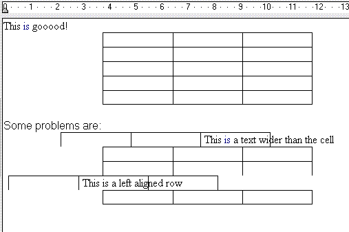

<div align="center">

## A routine to insert tables in Richtextbox


</div>

### Description

This is a routine that add a table to the current selection in a RichTextBox. I didn't find how can I do this on the web, so I made it by looking on the rtf Specification. I expect that this would be helpfull for those who are using RTB. If you find how to fix the problems i found please send me your work. (Sorry for my english ;) )
 
### More Info
 


<span>             |<span>
---                |---
**Submitted On**   |
**By**             |[Mario Villanueva](https://github.com/Planet-Source-Code/PSCIndex/blob/master/ByAuthor/mario-villanueva.md)
**Level**          |Intermediate
**User Rating**    |5.0 (10 globes from 2 users)
**Compatibility**  |VB 6\.0
**Category**       |[Custom Controls/ Forms/  Menus](https://github.com/Planet-Source-Code/PSCIndex/blob/master/ByCategory/custom-controls-forms-menus__1-4.md)
**World**          |[Visual Basic](https://github.com/Planet-Source-Code/PSCIndex/blob/master/ByWorld/visual-basic.md)
**Archive File**   |[](https://github.com/Planet-Source-Code/mario-villanueva-a-routine-to-insert-tables-in-richtextbox__1-63675/archive/master.zip)


### Source Code

```
Public Sub InsertTable(Rtb as RichTextBox, vRows as integer,vCols as integer)
Dim A As String, i As Integer, j As Integer
A = "{\rtf1\ansi\ansicpg1252\deff0" & _
"{\fonttbl{\f0\froman\fprq2\fcharset0 Times New Roman;}}" & _
"\viewkind4\uc1\trowd\trqc\trgaph108\trleft-8" & _
"\trbrdrt\brdrs\brdrw10" & _
"\trbrdrl\brdrs\brdrw10" & _
"\trbrdrb\brdrs\brdrw10" & _
"\trbrdrr\brdrs\brdrw10"
For i = 1 To vCols
  A = A & "\clbrdrt\brdrw15\brdrs" & _
      "\clbrdrl\brdrw15\brdrs" & _
      "\clbrdrb\brdrw15\brdrs" & _
      "\clbrdrr\brdrw15\brdrs" & _
      "\cellx" & _
      CStr((ScaleX(Rtb.Width, Rtb.Parent.ScaleMode, vbTwips) \ vCols * 2) * i) & _
      "\clbrdrt"
Next
A = A & "\pard\intbl\lang3082\f0\fs24"
For i = 1 To vRows
  A = A & "\intbl\clmrg"
  For j = 1 To vCols
    A = A & "\cell"
  Next
  A = A & "\row"
Next
A = A & "}"
Rtb.SelText = A
End Sub
```

